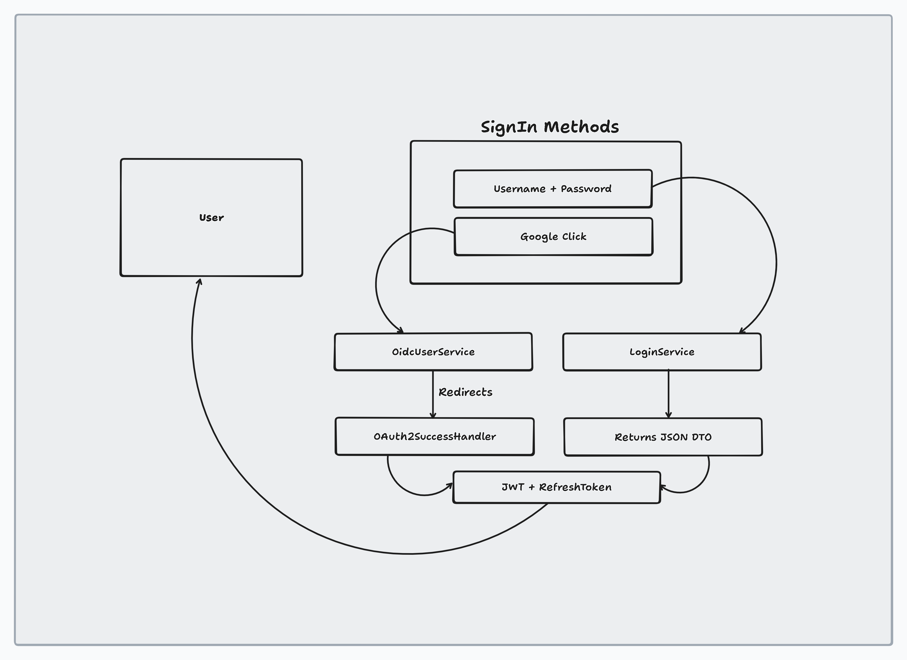

# Task Manager - Cookie-Based JWT Authentication

## Overview

## Hybrid Authentication Flow: JWT + OAuth2 with Secure Cookies

This project uses a hybrid authentication approach with **cookie-based JWT tokens**, combining traditional JWT-based login and OAuth2 (Google) login. Both methods store JWT access and refresh tokens in **secure HTTP cookies**, enabling stateless authentication with enhanced security for Single Page Applications (SPA).

### Flow Diagram



**Diagram Explanation:**
- **SignIn Methods:** User can sign in using either username/password or Google OAuth2.
- **Username + Password:** Handled by `AuthService`, which authenticates and returns JWT tokens in HTTP-only cookies.
- **Google Click:** Handled by `CustomOidcUserService` and `CustomSuccessHandler`, which sets JWT tokens in cookies after OAuth2 authentication.
- **JWT + RefreshToken:** Both flows converge to provide stateless authentication tokens stored securely in cookies.
- **Automatic Token Refresh:** Frontend automatically detects expired tokens (3-minute expiry) and refreshes them using the refresh token cookie.

This hybrid approach allows flexible authentication, supporting both social login and traditional credentials, while maintaining a unified cookie-based security model.

---
This project implements a **stateless JWT-based authentication system** with **OAuth2 Google login** using **secure HTTP cookies** for token storage. After successful authentication (via Google OAuth2 or traditional email/password), JWT tokens are automatically stored in browser cookies, providing seamless and secure authentication without exposing tokens in URLs or localStorage.

### Key Features
- ✅ OAuth2 integration with Google (OIDC)
- ✅ JWT-based stateless authentication with **cookie storage**
- ✅ **Automatic token refresh** on expiration (3-minute access token)
- ✅ **Secure cookie configuration** (SameSite, Path, HttpOnly)
- ✅ Refresh token implementation with rotation (7-day expiry)
- ✅ **Dual authentication support**: Authorization header + Cookie-based
- ✅ Spring Security 7.x configuration
- ✅ Role-based access control
- ✅ Clean separation of concerns with `CookieUtil` service

---

## Cookie-Based Authentication Flow

### Google OAuth2 Login Flow

1. **User Initiates Login**
   - User clicks "Login with Google" button
   - Redirected to Google's OAuth2 authorization page

2. **Google Authentication**
   - User authenticates with Google
   - Google redirects back to application with authorization code

3. **Backend Token Generation & Cookie Storage**
   - Backend exchanges authorization code for user info
   - Creates/updates user in database
   - Generates JWT access token (3-minute expiry)
   - Generates refresh token (7-day expiry)
   - **Sets tokens in HTTP cookies:**
     - `accessToken`: HttpOnly=false, Path=/, MaxAge=180s
     - `refreshToken`: HttpOnly=false, Path=/, MaxAge=604800s

4. **Frontend Authentication**
   - Browser automatically includes cookies in all requests
   - Frontend reads accessToken from cookie to display user info
   - No manual token management required

5. **Automatic Token Refresh**
   - When access token expires (3 minutes), backend returns 401
   - Frontend detects 401 and calls `/api/refresh/token`
   - Backend validates refresh token and issues new tokens in cookies
   - Request is automatically retried with new tokens

### Email/Password Login Flow

1. **User Submits Credentials**
   - POST `/api/auth/login` with email and password

2. **Backend Validation & Token Generation**
   - Spring Security authenticates credentials
   - Generates JWT tokens
   - **Sets tokens in HTTP cookies** (same as OAuth2)

3. **Frontend Authentication**
   - Cookies automatically included in subsequent requests
   - User is authenticated

### Why Cookie-Based Authentication?

**Advantages:**
- ✅ **Automatic inclusion**: Browser sends cookies with every request
- ✅ **XSS protection**: HttpOnly cookies cannot be accessed by JavaScript
- ✅ **CSRF protection**: SameSite=Lax prevents cross-site attacks
- ✅ **Seamless refresh**: Token rotation happens transparently
- ✅ **No manual storage**: No need for localStorage or sessionStorage
- ✅ **Production-ready**: Industry standard for web applications

**Security Features:**
- ✅ Short-lived access tokens (3 minutes) minimize attack window
- ✅ Refresh token rotation on every use
- ✅ SameSite=Lax prevents CSRF attacks
- ✅ Secure flag for HTTPS in production
- ✅ Proper cookie path restrictions

## Implementation Details

### Cookie Configuration

**CookieUtil** service handles all cookie operations:

```java
@Component
public class CookieUtil {
    private static final int ACCESS_TOKEN_MAX_AGE = 180; // 3 minutes
    private static final int REFRESH_TOKEN_MAX_AGE = 604800; // 7 days

    public ResponseCookie createAccessTokenCookie(String token) {
        return ResponseCookie.from("accessToken", token)
                .httpOnly(false)
                .secure(false) // Set to true in production with HTTPS
                .path("/")
                .maxAge(ACCESS_TOKEN_MAX_AGE)
                .sameSite("Lax")
                .build();
    }
    
    public ResponseCookie createRefreshTokenCookie(String token) {
        return ResponseCookie.from("refreshToken", token)
                .httpOnly(false)
                .secure(false) // Set to true in production
                .path("/")
                .maxAge(REFRESH_TOKEN_MAX_AGE)
                .sameSite("Lax")
                .build();
    }
}
```

### OAuth2 Google Configuration

**CustomSuccessHandler** handles successful OAuth2 authentication and sets cookie tokens:

```java
@Component
public class CustomSuccessHandler extends SimpleUrlAuthenticationSuccessHandler {
    @Autowired
    private CookieUtil cookieUtil;
    
    @Override
    public void onAuthenticationSuccess(...) {
        // Extract user from Google OIDC token
        DefaultOidcUser oidcUser = (DefaultOidcUser) authentication.getPrincipal();
        
        // Create/update user in database
        User user = userRepository.findByEmail(email).orElseGet(() -> createNewUser(email, name));
        
        // Generate tokens
        String accessToken = jwtService.generateToken(user);
        String refreshToken = refreshTokenService.createRefreshToken(user).getToken();
        
        // Set cookies
        response.addHeader(HttpHeaders.SET_COOKIE, cookieUtil.createAccessTokenCookie(accessToken).toString());
        response.addHeader(HttpHeaders.SET_COOKIE, cookieUtil.createRefreshTokenCookie(refreshToken).toString());
        
        // Redirect to frontend (cookies are already set)
        getRedirectStrategy().sendRedirect(request, response, "http://localhost:8080/");
    }
}
```

### Email/Password Login with Cookies

**AuthController** handles traditional login and sets cookies:

```java
@PostMapping("/login")
public ResponseEntity<LoginResponseDTO> authenticate(@RequestBody LoginDTO request) {
    LoginResponseDTO response = authService.login(request);
    
    return ResponseEntity.ok()
            .header(HttpHeaders.SET_COOKIE, cookieUtil.createAccessTokenCookie(response.getToken()).toString())
            .header(HttpHeaders.SET_COOKIE, cookieUtil.createRefreshTokenCookie(response.getRefreshToken()).toString())
            .body(response);
}
```

### JWT Authentication Filter with Cookie Support

**JwtAuthenticationFilter** checks both Authorization header and cookies:

```java
@Override
protected void doFilterInternal(HttpServletRequest request, HttpServletResponse response, FilterChain filterChain) {
    String jwt = null;
    
    // First, check Authorization header (backward compatible)
    String authHeader = request.getHeader("Authorization");
    if (authHeader != null && authHeader.startsWith("Bearer ")) {
        jwt = authHeader.substring(7);
    }
    
    // If no header, check for accessToken cookie
    if (jwt == null) {
        Cookie[] cookies = request.getCookies();
        if (cookies != null) {
            for (Cookie cookie : cookies) {
                if ("accessToken".equals(cookie.getName())) {
                    jwt = cookie.getValue();
                    break;
                }
            }
        }
    }
    
    // Validate JWT and set authentication
    if (jwt != null) {
        String userName = jwtService.extractUserName(jwt);
        UserDetails userDetails = userDetailsService.loadUserByUsername(userName);
        
        if (jwtService.isTokenValid(jwt, userDetails)) {
            UsernamePasswordAuthenticationToken authToken = 
                new UsernamePasswordAuthenticationToken(userDetails, null, userDetails.getAuthorities());
            SecurityContextHolder.getContext().setAuthentication(authToken);
        }
    }
    
    filterChain.doFilter(request, response);
}
```

### Automatic Token Refresh

**Frontend** (JavaScript):

```javascript
// Helper to get cookie value
function getCookie(name) {
  const value = `; ${document.cookie}`;
  const parts = value.split(`; ${name}=`);
  if (parts.length === 2) return parts.pop().split(';').shift();
  return null;
}

// Automatic retry on 401 with token refresh
async function request(path, options = {}, retry = true) {
  const response = await fetch(path, { ...options, credentials: 'include' });

  if (response.status === 401 && retry) {
    console.log('[Frontend] Got 401, attempting token refresh...');
    const refreshed = await refreshAccessToken();
    if (refreshed) {
      console.log('[Frontend] Token refreshed successfully, retrying request...');
      return request(path, options, false);
    }
  }

  return response;
}

async function refreshAccessToken() {
  const refreshToken = getCookie('refreshToken');
  if (!refreshToken) return false;

  const response = await fetch('/api/refresh/token', {
    method: 'POST',
    headers: { 'Content-Type': 'application/json' },
    credentials: 'include',
    body: JSON.stringify({ refreshToken })
  });

  if (!response.ok) {
    clearAuthState();
    return false;
  }

  console.log('[Frontend] New tokens set in cookies');
  return true;
}
```

**Backend** - RefreshTokenController sets new cookies:

```java
@PostMapping("/token")
public ResponseEntity<TokenResponseDto> refreshToken(@RequestBody TokenRequestDto request) {
    TokenResponseDto response = refreshTokenService.rotateToken(request.getRefreshToken());
    
    return ResponseEntity.ok()
            .header(HttpHeaders.SET_COOKIE, cookieUtil.createAccessTokenCookie(response.getAccessToken()).toString())
            .header(HttpHeaders.SET_COOKIE, cookieUtil.createRefreshTokenCookie(response.getRefreshToken()).toString())
            .body(response);
}
```

### Logout with Cookie Cleanup

**AuthController**:

```java
@PostMapping("/logout")
public ResponseEntity<Void> logout(@AuthenticationPrincipal User user) {
    // Delete all refresh tokens from database
    if (user != null) {
        authService.logout(user);
    }
    
    // Clear cookies
    return ResponseEntity.ok()
            .header(HttpHeaders.SET_COOKIE, cookieUtil.deleteAccessTokenCookie().toString())
            .header(HttpHeaders.SET_COOKIE, cookieUtil.deleteRefreshTokenCookie().toString())
            .build();
}
```

**Frontend**:

```javascript
logoutBtn.addEventListener('click', async () => {
  await fetch('/api/auth/logout', {
    method: 'POST',
    credentials: 'include'
  });
  
  clearAuthState();
  setUiAuthenticated(false);
});
```

**Frontend Token Extraction** (JavaScript):

```javascript
// On page load, check for accessToken cookie
const accessToken = getCookie('accessToken');

if (accessToken) {
  // Extract email from JWT token
  try {
    const parts = accessToken.split('.');
    if (parts.length === 3) {
      const decoded = JSON.parse(atob(parts[1]));
      const email = decoded.sub;
      setAuthState({ email: email });
    }
  } catch (e) {
    console.error('Failed to parse token', e);
  }
  
  setUiAuthenticated(true);
  await loadTasks();
} else {
  setUiAuthenticated(false);
}
```

---

## JWT Stateless Authentication Configuration

### Step 1: Add Dependencies
**File**: `pom.xml`

Added JWT and Security dependencies:
```xml
<!-- JWT Library -->
<dependency>
    <groupId>io.jsonwebtoken</groupId>
    <artifactId>jjwt-api</artifactId>
    <version>0.13.0</version>
</dependency>
<dependency>
    <groupId>io.jsonwebtoken</groupId>
    <artifactId>jjwt-impl</artifactId>
    <version>0.13.0</version>
    <scope>runtime</scope>
</dependency>
<dependency>
    <groupId>io.jsonwebtoken</groupId>
    <artifactId>jjwt-jackson</artifactId>
    <version>0.13.0</version>
    <scope>runtime</scope>
</dependency>

<!-- Spring Security -->
<dependency>
    <groupId>org.springframework.boot</groupId>
    <artifactId>spring-boot-starter-security</artifactId>
</dependency>
```

### Step 2: Configure JWT Properties
**File**: `application.properties`

Added JWT configuration:
```properties
jwt.secret=your_base64_encoded_secret_key_minimum_256_bits
jwt.expiration=3600000
spring.jpa.show-sql=false
```

**Important**: The `jwt.secret` must be a Base64-encoded string of at least 256 bits (32 bytes).

### Step 3: Create Security Configuration
**File**: `src/main/java/com/microservice/taskmanager/config/SecurityConfig.java`

**Configuration Details**:
```java
@Configuration
@EnableMethodSecurity
@RequiredArgsConstructor
public class SecurityConfig {
    
    private final JwtAuthenticationFilter authenticationFilter;

    @Bean
    public SecurityFilterChain securityFilterChain(HttpSecurity http) throws Exception {
        http
            .csrf(AbstractHttpConfigurer::disable)
            .sessionManagement(session -> 
                session.sessionCreationPolicy(SessionCreationPolicy.STATELESS))
            .authorizeHttpRequests(auth -> auth
                .requestMatchers("/api/auth/**").permitAll()
                .anyRequest().authenticated())
            .addFilterBefore(authenticationFilter, 
                UsernamePasswordAuthenticationFilter.class);
        return http.build();
    }

    @Bean
    public PasswordEncoder passwordEncoder() {
        return new BCryptPasswordEncoder();
    }

    @Bean
    public AuthenticationManager authenticationManager(HttpSecurity http) 
            throws Exception {
        return http.getSharedObject(AuthenticationManagerBuilder.class)
            .build();
    }
}
```

**What Changed**:
- **Before**: Session-based → Spring created sessions automatically
- **After**: Stateless → No sessions, each request contains token in `Authorization` header

### Step 4: Create JWT Service
**File**: `src/main/java/com/microservice/taskmanager/auth/JwtService.java`

**Responsibilities**:
- ✅ Generate JWT tokens from `UserDetails`
- ✅ Extract username from JWT token
- ✅ Validate token expiration and signature
- ✅ Manage secret key encoding/decoding

**Key Methods**:
```java
public String generateToken(UserDetails userDetails) {
    // Creates token with 1-hour expiration
    return Jwts.builder()
        .subject(userDetails.getUsername())
        .issuedAt(new Date(System.currentTimeMillis()))
        .expiration(new Date(System.currentTimeMillis() + jwtExpiration))
        .signWith(getSecretKey(), SignatureAlgorithm.HS256)
        .compact();
}

public boolean isTokenValid(String jwt, UserDetails userDetails) {
    final String username = extractUserName(jwt);
    return username.equals(userDetails.getUsername()) 
        && !isTokenExpired(jwt);
}
```

**Configuration**:
```java
@Value("${jwt.secret}")  // Must include ${} for property placeholder resolution
@Value("${jwt.expiration}")
```

### Step 5: Create JWT Authentication Filter
**File**: `src/main/java/com/microservice/taskmanager/auth/JwtAuthenticationFilter.java`

**Responsibilities**:
- ✅ Intercepts every HTTP request
- ✅ Extracts JWT from `Authorization: Bearer <token>` header
- ✅ Validates token using `JwtService`
- ✅ Sets authentication in `SecurityContext`
- ✅ Skips validation for public endpoints (`/api/auth/**`)

**Filter Logic**:
```java
@Override
protected void doFilterInternal(HttpServletRequest request, 
        HttpServletResponse response, 
        FilterChain filterChain) throws ServletException, IOException {
    
    // Skip filter for public endpoints
    if (shouldNotFilter(request)) {
        filterChain.doFilter(request, response);
        return;
    }

    final String authHeader = request.getHeader("Authorization");
    
    if (authHeader == null || !authHeader.startsWith("Bearer ")) {
        filterChain.doFilter(request, response);
        return;
    }

    final String jwt = authHeader.substring(7);
    final String userEmail = jwtService.extractUserName(jwt);

    if (userEmail != null) {
        UserDetails userDetails = userDetailsService
            .loadUserByUsername(userEmail);
        
        if (jwtService.isTokenValid(jwt, userDetails)) {
            UsernamePasswordAuthenticationToken authToken = 
                new UsernamePasswordAuthenticationToken(
                    userDetails, null, userDetails.getAuthorities());
            authToken.setDetails(
                new WebAuthenticationDetailsSource().buildDetails(request));
            SecurityContextHolder.getContext()
                .setAuthentication(authToken);
        }
    }
    filterChain.doFilter(request, response);
}

@Override
protected boolean shouldNotFilter(HttpServletRequest request) {
    return pathMatcher.match("/api/auth/**", 
        request.getServletPath());
}
```

**What Changed**:
- **Before**: Automatic session creation and validation
- **After**: Manual token extraction and validation per request

### Step 6: Create Authentication Service
**File**: `src/main/java/com/microservice/taskmanager/service/AuthService.java`

**Responsibilities**:
- ✅ Handle user registration with password hashing
- ✅ Handle user login with authentication
- ✅ Generate JWT token after successful authentication

**Methods**:
```java
public void registerUser(RegisterRequestDTO dto) {
    User user = new User();
    user.setEmail(dto.getEmail());
    user.setPassword(passwordEncoder.encode(dto.getPassword()));
    user.setRole(Role.USER);
    userRepository.save(user);
}

public LoginResponseDTO login(LoginDTO dto) {
    authenticationManager.authenticate(
        new UsernamePasswordAuthenticationToken(
            dto.getEmail(), dto.getPassword()));
    
    User user = userRepository.findByEmail(dto.getEmail())
        .orElseThrow();
    String token = jwtService.generateToken(user);
    
    return LoginResponseDTO.builder()
        .token(token)
        .build();
}
```


### Step 7: Create User Details Service
**File**: `src/main/java/com/microservice/taskmanager/auth/CustomerUserDetailsService.java`

**Responsibilities**:
- ✅ Load user from database by email (Spring Security interface)
- ✅ Used by both authentication and JWT validation

```java
@Override
public UserDetails loadUserByUsername(String email) 
        throws UsernameNotFoundException {
    return userRepository.findByEmail(email)
        .orElseThrow(() -> new UsernameNotFoundException(
            "User not found with email: " + email));
}
```

### Step 8: Add Method Security with @PreAuthorize
**File**: `src/main/java/com/microservice/taskmanager/controller/TaskController.java`

**Requirements**:
- ✅ `@EnableMethodSecurity` annotation on `SecurityConfig`
- ✅ `@PreAuthorize` annotations on controller/service methods

**Usage**:
```java
@GetMapping
@PreAuthorize("hasRole('USER')")
public ResponseEntity<List<TaskResponseDto>> getAllTasks() {
    return ResponseEntity.ok(taskService.getMyTask());
}

@DeleteMapping("/{id}")
@PreAuthorize("hasRole('ADMIN') or @taskService.isOwner(#id, authentication.name)")
public ResponseEntity<Void> deleteTask(@PathVariable Long id) {
    taskService.deleteTask(id);
    return ResponseEntity.noContent().build();
}
```


### Step 9: Add @Transactional for Database Operations
**File**: `src/main/java/com/microservice/taskmanager/service/TaskService.java`

**Requirement**: JPA delete operations need transaction context

```java
@Transactional
public void deleteTask(long id) {
    taskRepository.deleteByTaskId(id);
}
```


### Step 10: Use DTOs Instead of Entity Objects
**Changes**:
- ✅ POST `/api/tasks` returns `TaskResponseDto` (not `Task` entity)
- ✅ Prevents circular reference serialization
- ✅ Cleaner API contracts

**Before**:
```java
public ResponseEntity<Task> createTask(...) {
    return ResponseEntity.status(HttpStatus.CREATED)
        .body(taskService.createTask(request));
}
```

**After**:
```java
public ResponseEntity<TaskResponseDto> createTask(...) {
    return ResponseEntity.status(HttpStatus.CREATED)
        .body(taskService.createTask(request));
}
```

---

## Complete Request/Response Flow (Stateless)

### 1. Registration Flow
```
POST /api/auth/register
Body: {"email": "user@example.com", "password": "Test@123"}
↓
AuthService.registerUser()
  ├── Encode password with BCryptPasswordEncoder
  ├── Create User with ROLE_USER
  └── Save to database
↓
Response: 200 OK (User created)
```

### 2. Login Flow
```
POST /api/auth/login
Body: {"email": "user@example.com", "password": "Test@123"}
↓
AuthService.login()
  ├── AuthenticationManager.authenticate() - validates credentials
  ├── Load User from database
  ├── JwtService.generateToken(user)
  │   ├── Encode username in JWT
  │   ├── Set expiration to current_time + 1_hour
  │   └── Sign with HMAC-SHA256
  └── Return token
↓
Response: 200 OK {"token": "eyJhbGc..."}
```

### 3. Authenticated Request Flow
```
GET /api/tasks
Header: Authorization: Bearer eyJhbGc...
↓
JwtAuthenticationFilter.doFilterInternal()
  ├── Extract token from Authorization header
  ├── JwtService.extractUserName(token) - decode JWT
  ├── Load UserDetails from database
  ├── JwtService.isTokenValid(token, userDetails)
  │   ├── Check username matches
  │   ├── Check expiration time
  │   └── Verify signature
  ├── Create UsernamePasswordAuthenticationToken
  └── Set in SecurityContext
↓
@PreAuthorize("hasRole('USER')")
  └── Check authorities from SecurityContext
↓
TaskService.getMyTask()
  ├── Get email from SecurityContext.getAuthentication().getName()
  └── Query database
↓
Response: 200 OK [tasks...]
```

---

## API Endpoints Summary

| Method | Endpoint | Auth | Description |
|--------|----------|------|-------------|
| POST | `/api/auth/register` | ❌ Public | Register new user |
| POST | `/api/auth/login` | ❌ Public | Login and get JWT token |
| GET | `/api/tasks` | ✅ USER | Get user's tasks (with pagination & sorting) |
| POST | `/api/tasks` | ✅ USER | Create new task |
| DELETE | `/api/tasks/{id}` | ✅ ADMIN or Owner | Delete task |
| POST | `/api/refresh/token` | ❌ Public | Refresh expired JWT token |

---

## Pagination & Sorting Feature

### Overview
The Task Manager implements **server-side pagination and sorting** using Spring Data JPA's `Pageable` interface. Users can retrieve tasks with custom page size, sorting field, and sort direction through REST API query parameters.

### Architecture

**Three-Layer Implementation:**

#### 1. REST API Layer (TaskController)
```java
@GetMapping
@PreAuthorize("hasRole('USER')")
public ResponseEntity<List<TaskResponseDto>> getAllTasks(
    @RequestParam(defaultValue = "0") int page,
    @RequestParam(defaultValue = "10") int size,
    @RequestParam(defaultValue = "taskId") String sortBy,
    @RequestParam(defaultValue = "asc") String direction
) {
    return ResponseEntity.ok(taskService.getMyTask(page, size, sortBy, direction));
}
```

**Query Parameters:**
- `page` (int, default=0): Zero-indexed page number
- `size` (int, default=10): Number of results per page
- `sortBy` (String, default="taskId"): Field name to sort by (taskId or headLine)
- `direction` (String, default="asc"): Sort direction (asc or desc)

**Example Requests:**
```bash
# Default pagination (page 0, 10 results, sorted by taskId ascending)
GET /api/tasks

# Page 2, 20 results per page, sorted by headLine descending
GET /api/tasks?page=2&size=20&sortBy=headLine&direction=desc

# First page with 5 results, sorted by taskId ascending
GET /api/tasks?page=0&size=5&sortBy=taskId
```

#### 2. Business Logic Layer (TaskService)
```java
@PreAuthorize("hasRole('USER')")
public List<TaskResponseDto> getMyTask(int page, int size, String sortBy, String direction) {
    String email = SecurityContextHolder.getContext().getAuthentication().getName();
    
    // Construct Sort object based on direction
    Sort sort = direction.equalsIgnoreCase("desc")
        ? Sort.by(sortBy).descending()
        : Sort.by(sortBy).ascending();
    
    // Create PageRequest with sort configuration
    Pageable pageable = PageRequest.of(page, size, sort);
    
    // Query database with pagination and sorting
    Page<Task> taskPage = taskRepository.findByUser_Email(email, pageable);
    
    // Map Task entities to DTOs
    return taskPage.map(taskMapper::toResponseDto).getContent();
}
```

**Key Features:**
- ✅ Retrieves current user from SecurityContext
- ✅ Constructs Sort object dynamically based on user parameters
- ✅ Creates PageRequest combining page, size, and sort configuration
- ✅ Maps Task entities to TaskResponseDto using MapStruct
- ✅ Returns only the content (List), not pagination metadata

#### 3. Data Access Layer (TaskRepository)
```java
public interface TaskRepository extends JpaRepository<Task, Long> {
    Page<Task> findByUser_Email(String email, Pageable pageable);
    void deleteByTaskId(Long taskId);
}
```

**Spring Data JPA Magic:**
- ✅ Automatically generates SQL with WHERE, ORDER BY, LIMIT/OFFSET clauses
- ✅ Supports Pageable parameter for pagination and sorting
- ✅ No manual SQL writing required

### Frontend Integration

#### HTML UI Controls (index.html)
```html
<div class="pagination-controls">
    <label>Page: <input id="taskPage" type="number" min="0" value="0" style="width:50px;"></label>
    <label>Size: <input id="taskSize" type="number" min="1" value="10" style="width:50px;"></label>
    <label>Sort By: 
        <select id="taskSortBy">
            <option value="taskId">Task ID</option>
            <option value="headLine">Headline</option>
        </select>
    </label>
    <label>Direction: 
        <select id="taskDirection">
            <option value="asc">Ascending</option>
            <option value="desc">Descending</option>
        </select>
    </label>
    <button id="taskReloadBtn" type="button">Reload</button>
</div>
```

#### JavaScript API Integration (app.js)
```javascript
async function loadTasks() {
    // Get pagination parameters from UI controls
    const page = document.getElementById('taskPage')?.value || 0;
    const size = document.getElementById('taskSize')?.value || 10;
    const sortBy = document.getElementById('taskSortBy')?.value || 'taskId';
    const direction = document.getElementById('taskDirection')?.value || 'asc';
    
    // Construct query string with pagination parameters
    const url = `/api/tasks?page=${page}&size=${size}&sortBy=${sortBy}&direction=${direction}`;
    
    try {
        const response = await request(url, {
            method: 'GET',
            headers: { 'Content-Type': 'application/json' }
        });
        
        if (!response.ok) throw new Error(`HTTP ${response.status}`);
        
        // Get task list from response
        const tasks = await response.json();
        
        // Render tasks in UI
        renderTasks(tasks);
    } catch (error) {
        console.error('Failed to load tasks:', error);
        showError('Failed to load tasks');
    }
}

// Event listeners to trigger reload on parameter changes
document.getElementById('taskPage')?.addEventListener('change', loadTasks);
document.getElementById('taskSize')?.addEventListener('change', loadTasks);
document.getElementById('taskSortBy')?.addEventListener('change', loadTasks);
document.getElementById('taskDirection')?.addEventListener('change', loadTasks);
document.getElementById('taskReloadBtn')?.addEventListener('click', loadTasks);
```

### Data Flow Diagram

```
┌─────────────────────────────────────────────────────────┐
│         PAGINATION & SORTING REQUEST FLOW               │
└─────────────────────────────────────────────────────────┘

USER INTERACTION
────────────────
1. User changes pagination/sorting controls in UI
2. Event listener triggers loadTasks()
3. JavaScript constructs URL with query parameters
4. Fetch request sent: GET /api/tasks?page=1&size=20&sortBy=headLine&direction=desc

API REQUEST → CONTROLLER
───────────────────────
1. TaskController.getAllTasks() receives query parameters
2. Default values applied if parameters missing
3. Parameters passed to service layer

SERVICE LAYER PROCESSING
────────────────────────
1. TaskService.getMyTask(page=1, size=20, sortBy=headLine, direction=desc)
2. Current user email retrieved from SecurityContext
3. Sort object created: Sort.by("headLine").descending()
4. PageRequest created: PageRequest.of(1, 20, sort)
5. Call repository method with Pageable

DATABASE QUERY
──────────────
1. TaskRepository.findByUser_Email(email, pageable)
2. Spring Data JPA generates SQL:
   SELECT * FROM task 
   WHERE user_id = ? 
   ORDER BY head_line DESC 
   LIMIT 20 OFFSET 20

RESPONSE PROCESSING
───────────────────
1. Spring returns Page<Task> with metadata
2. Service maps Task entities to TaskResponseDto
3. Service returns content list (pagination metadata discarded)
4. Controller returns ResponseEntity with task list

FRONTEND RENDERING
──────────────────
1. JavaScript receives JSON array of tasks
2. renderTasks() updates DOM with task list
3. UI reflects current pagination state (page 1, showing 20 results)
```

### Available Sortable Fields

Currently supported fields for sorting:
- ✅ `taskId` - Task unique identifier (default)
- ✅ `headLine` - Task headline/title

**Future Enhancement:** Extend to support additional fields (description, createdDate, lastModifiedDate, etc.)

### Pagination Behavior

**Pagination Calculation:**
- **Page Size**: Number of results per page (1-100 recommended, default=10)
- **Page Number**: Zero-indexed (0 = first page, 1 = second page, etc.)
- **Offset Calculation**: offset = page × size
  - Page 0, Size 10 → offset = 0 (results 0-9)
  - Page 1, Size 10 → offset = 10 (results 10-19)
  - Page 2, Size 20 → offset = 40 (results 40-59)

### Sorting Behavior

**Direction Options:**
- `asc` (ascending): Lowest to highest (A-Z, 0-9)
- `desc` (descending): Highest to lowest (Z-A, 9-0)

**Example Sort Results:**
```
sortBy=taskId&direction=asc:   Task 1, Task 2, Task 3, ...
sortBy=taskId&direction=desc:  Task 999, Task 998, Task 997, ...
sortBy=headLine&direction=asc: Apple, Banana, Cherry, ...
sortBy=headLine&direction=desc: Zebra, Yarn, Xylophone, ...
```

### Security Features

✅ **Role-Based Access**: @PreAuthorize("hasRole('USER')")
✅ **User Context Isolation**: SecurityContext ensures users only see their tasks
✅ **Email-Based Filtering**: Query filters by authenticated user's email
✅ **No Data Leakage**: JOIN statements prevent accessing other users' tasks

### Response Format

**Response Body** (List of TaskResponseDto):
```json
[
    {
        "taskId": 1,
        "headLine": "Complete project documentation",
        "description": "Write comprehensive documentation for the task manager"
    },
    {
        "taskId": 2,
        "headLine": "Fix pagination bugs",
        "description": "Resolve issues with page navigation"
    }
]
```

**Note**: Response is a List, not a Page object. Pagination metadata (total records, total pages, etc.) is not returned to the client.

### Testing Pagination & Sorting

```bash
# Get first page (default: 10 results, sorted by taskId ascending)
curl -X GET "http://localhost:8080/api/tasks" \
  -H "Authorization: Bearer YOUR_JWT_TOKEN"

# Get second page with 20 results per page
curl -X GET "http://localhost:8080/api/tasks?page=1&size=20" \
  -H "Authorization: Bearer YOUR_JWT_TOKEN"

# Sort by headline in descending order
curl -X GET "http://localhost:8080/api/tasks?sortBy=headLine&direction=desc" \
  -H "Authorization: Bearer YOUR_JWT_TOKEN"

# Combined: page 2, size 15, sorted by headline descending
curl -X GET "http://localhost:8080/api/tasks?page=2&size=15&sortBy=headLine&direction=desc" \
  -H "Authorization: Bearer YOUR_JWT_TOKEN"
```

### Performance Considerations

✅ **Database Indexing**: Ensure columns used in sorting have database indexes
✅ **Page Size Limits**: Consider enforcing maximum page size (e.g., max 100) to prevent abuse
✅ **Lazy Loading**: DTOs prevent loading related entities, improving query performance
✅ **Query Optimization**: Spring Data JPA generates optimized SQL with LIMIT/OFFSET

### Future Enhancements

1. **Return Pagination Metadata**: Modify response to include total records, total pages, current page, has next/previous
2. **Dynamic Field Validation**: Implement whitelist validation for sortBy parameter
3. **Multiple Sort Fields**: Support sorting by multiple fields (e.g., taskId asc, headLine desc)
4. **Search Filtering**: Add filtering by keyword, date range, status
5. **Cursor-Based Pagination**: Alternative to offset-based for large datasets
6. **Custom Comparators**: Client-side sorting options for specific use cases

---

## Key Components Added

### Annotations
- `@EnableMethodSecurity` - Enables method-level security
- `@PreAuthorize` - Method-level authorization
- `@Transactional` - Transaction management
- `@JsonIgnore` - Prevent circular serialization

### Services
- `JwtService` - Token generation/validation
- `AuthService` - Registration/login
- `CustomerUserDetailsService` - User loading

### Filters
- `JwtAuthenticationFilter` - JWT token extraction and validation

### Beans
- `PasswordEncoder` - BCryptPasswordEncoder
- `AuthenticationManager` - Authentication processing
- `SecurityFilterChain` - HTTP security configuration

---

## Security Features Implemented

✅ **Password Hashing**: BCrypt with auto-generated salt
✅ **JWT Tokens**: HS256 signed, 1-hour expiration
✅ **Role-Based Access**: ROLE_USER and ROLE_ADMIN
✅ **Method-Level Security**: @PreAuthorize expressions
✅ **CSRF Protection**: Disabled (stateless API)
✅ **Session Management**: Disabled (STATELESS)
✅ **Public Endpoints**: /api/auth/** bypasses JWT filter
✅ **Ownership Validation**: Users can only delete their own tasks

---

## Notes

### 🔐 Security Considerations

#### URL-Based Token Transition: Security & Performance

**Security:**
- Tokens are visible in the URL only briefly after login; frontend removes them immediately.
- Always use HTTPS to protect tokens during transit.
- Access tokens are short-lived; refresh tokens are rotated for safety.
- Avoid logging URLs containing tokens; browser history may expose them.
- For production, consider HttpOnly cookies or other secure storage.

**Performance:**
- Stateless JWT validation enables horizontal scaling and microservice compatibility.
- No session affinity required; any server can validate tokens.
- Token validation is fast (signature check, no DB call if user info is cached).

### 🔧 Configuration Properties

```properties
# JWT Configuration
jwt.secret=your_base64_secret_key_here          # REQUIRED
jwt.expiration=3600000                          # 1 hour in milliseconds

# Hibernate Configuration
spring.jpa.show-sql=false                       # Set true for debugging
spring.hibernate.ddl-auto=update                # Auto-schema management

# Server Configuration
server.port=8080
server.servlet.context-path=/
```

### 📊 Authentication Flow Diagram

```
┌─────────────────────────────────────────────────────────┐
│                 STATELESS JWT AUTH FLOW                 │
└─────────────────────────────────────────────────────────┘

USER REGISTRATION
─────────────────
1. POST /api/auth/register → AuthService
2. Password hashed → BCryptPasswordEncoder
3. User saved to database
4. Response: 200 OK

USER LOGIN
──────────
1. POST /api/auth/login → AuthService
2. Credentials validated → AuthenticationManager
3. JWT created → JwtService (Claims: email, exp, iat, alg, sig)
4. Response: 200 OK + JWT Token

AUTHENTICATED REQUEST
─────────────────────
1. Client sends: GET /api/tasks + Authorization: Bearer JWT
2. JwtAuthenticationFilter intercepts
3. Token extracted and validated
4. User loaded from database
5. Token signature verified
6. Authentication set in SecurityContext
7. @PreAuthorize checks authorities
8. Method executed if authorized
9. Response returned with data/error

LOGOUT
──────
- No server-side logout needed (stateless)
- Client deletes token from local storage
- Token still valid until expiration
- Optional: Implement token blacklist for immediate invalidation
```

### 🔄 Transition from Stateful to Stateless

**What You Gained**:
- ✅ Horizontal scalability (no session affinity)
- ✅ Microservices friendly (independent token validation)
- ✅ Mobile/SPA friendly (token in headers)
- ✅ Reduced server memory usage
- ✅ Better API design

**What You Lost**:
- ❌ Cannot revoke active sessions instantly (JWT valid until expiration)
- ❌ Token size in headers (minimal impact)
- ❌ No server-side session state (implement blacklist if needed)

### 🛠️ Future Improvements

1. Implement **Refresh Tokens** for better UX
2. Add **Token Blacklist** for immediate logout
3. Implement **Rate Limiting** on auth endpoints
4. Add **API Key** authentication for service-to-service
5. Implement **OAuth2/OIDC** for social login
6. Add **2FA** (Two-Factor Authentication)
7. Use **Keycloak** or **Auth0** for centralized auth

---

## Testing the Stateless Configuration

### Test All Endpoints
```bash
# 1. Register
curl -X POST http://localhost:8080/api/auth/register \
  -H "Content-Type: application/json" \
  -d '{"email":"user@test.com","password":"Test@123"}'

# 2. Login (get token)
curl -X POST http://localhost:8080/api/auth/login \
  -H "Content-Type: application/json" \
  -d '{"email":"user@test.com","password":"Test@123"}'

# 3. Create Task (with token)
curl -X POST http://localhost:8080/api/tasks \
  -H "Authorization: Bearer YOUR_JWT_TOKEN" \
  -H "Content-Type: application/json" \
  -d '{"headLine":"Test","description":"Test task"}'

# 4. Get Tasks
curl -X GET http://localhost:8080/api/tasks \
  -H "Authorization: Bearer YOUR_JWT_TOKEN"

# 5. Delete Task
curl -X DELETE http://localhost:8080/api/tasks/1 \
  -H "Authorization: Bearer YOUR_JWT_TOKEN"
```

---

**Document Version**: 2.1  
**Last Updated**: February 27, 2026  
**Framework**: Spring Boot 4.0.2 with Spring Security 7.0.2  
**Branch**: feature/pagination-sorting
